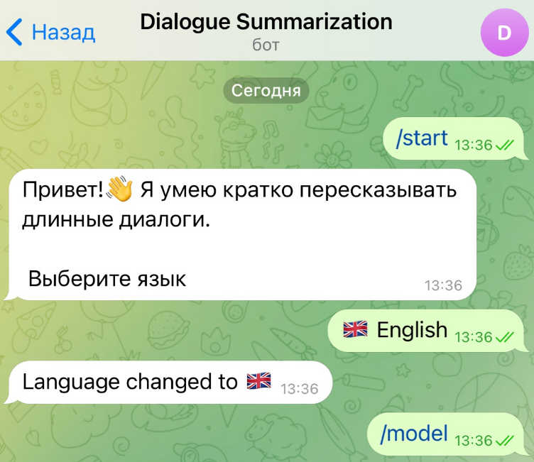

# Telegram-бот для суммаризации диалогов 


В проекте представлен полный цикл работы с NLP-моделью: дообучение (fine-tuning) архитектуры BART на диалоговых данных и интеграция полученной модели в Telegram-бот. Бот умеет принимать на вход длинные диалоги и генерировать их краткое осмысленное содержание (саммари).

👉 **Протестировать бота:** [@DialogueSummarizationBot](https://t.me/DialogueSummarizationBot)



## Как устроен Telegram-бот

Бот написан на Python с использованием асинхронного фреймворка `aiogram` (v2) и библиотеки `transformers` от Hugging Face. 

**Архитектурные особенности:**
1. **Асинхронность и потоки:** взаимодействие с Telegram API происходит асинхронно. Однако инференс (генерация текста языковой моделью через `model.generate()`) — это тяжелая синхронная операция. Чтобы бот не зависал и мог параллельно отвечать другим пользователям, вызов моделей вынесен в отдельный поток с помощью `asyncio.to_thread()`.
2. **Изоляция контекста:** история диалогов сохраняется в оперативной памяти и изолирована для каждого `user_id`. Пользователи не пересекаются друг с другом.
3. **Мультимодельность:** в бот интегрированы две модели, между которыми можно переключаться «на лету» без перезагрузки:
   * **BART (Fine-tuned):** `ainize/bart-base-cnn`, дообученная в рамках данного проекта на датасете `knkarthick/dialogsum`.
   * **Flan-T5 (Base):** базовая модель `google/flan-t5-base` для сравнения результатов генерации.

## Основные команды

Бот управляется через стандартные команды Telegram и inline-клавиатуры:

* `/start` — инициализация бота, приветственное сообщение и настройка языка интерфейса.
* `/help` — вывод справочной информации и списка доступных действий.
* `/model` — вызов меню для переключения языковой модели (BART или Flan-T5).
* `/checkmodel` — проверка того, какая модель загружена в контекст генерации в данный момент.
* `/clear` — очистка истории переписки и сброс контекста для текущего пользователя.

## ML-часть (Файнтюнинг)

Исследовательская часть вынесена в Jupyter Notebook (`notebooks/Bart-dialogue-summarization.ipynb`). 
* **Модель:** `ainize/bart-base-cnn`
* **Датасет:** `knkarthick/dialogsum` (содержит аннотированные диалоги).
* **Метрики:** оценка качества генерации производилась с помощью метрики **ROUGE**.
* **Обучение:** использовался класс `Trainer` из библиотеки `transformers`. 

## Установка и запуск локально

1. **Клонируйте репозиторий:**    
```bash
git clone https://github.com/SabiaPI1/Dialogue-Summarization-Bot.git
cd Dialogue-Summarization-Bot
```

2. **Создайте виртуальное окружение и установите зависимости:**    
```bash
python -m venv venv
source venv/bin/activate  # Для Windows: venv\Scripts\activate
pip install -r requirements.txt
```

3. **Настройте токен Telegram-бота:**    
Откройте файл `bot/main.py` и задайте переменной TOKEN значение вашего API-токена (полученного у `@BotFather`):
```python
TOKEN = "ВАШ_ТОКЕН_ЗДЕСЬ"
```

4. **Запустите бота:**    
```bash
python bot/main.py
```
